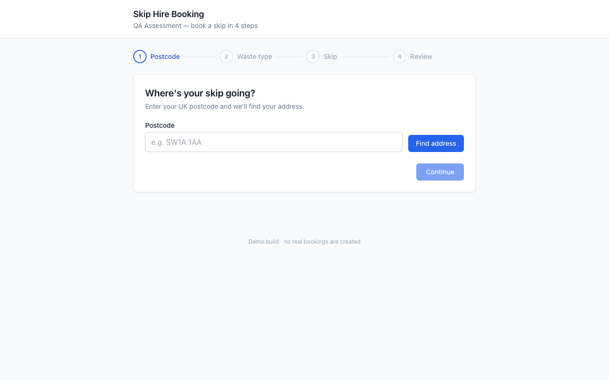
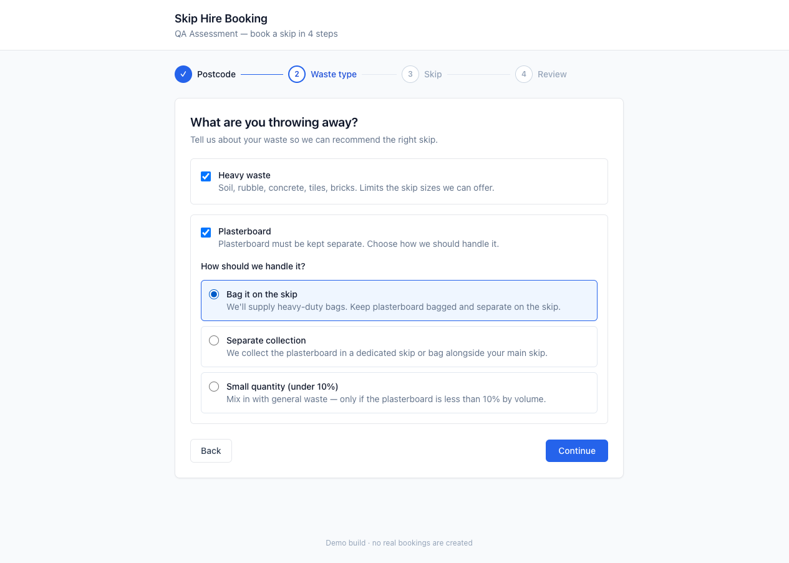
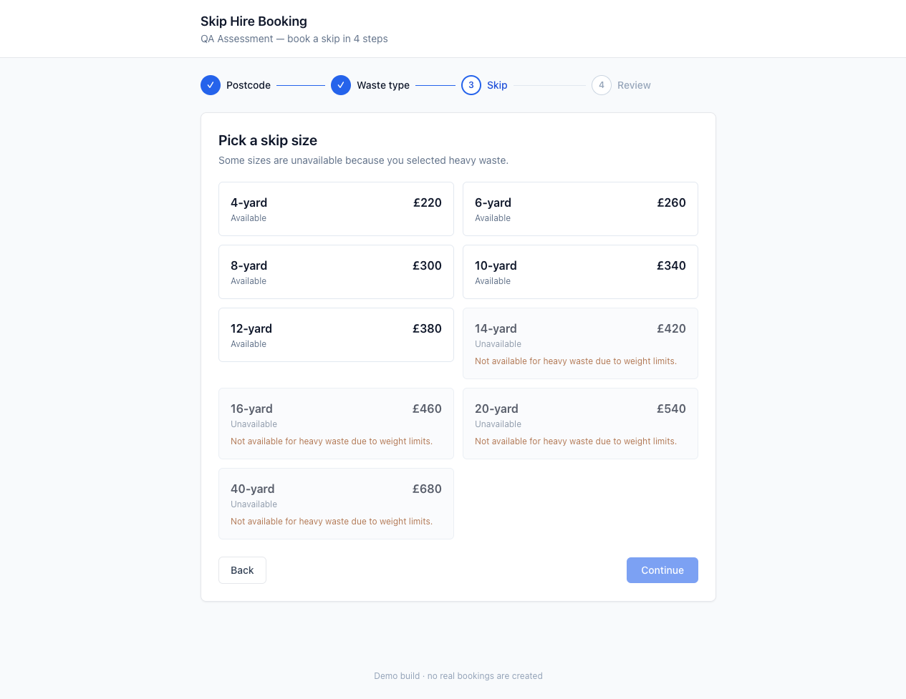
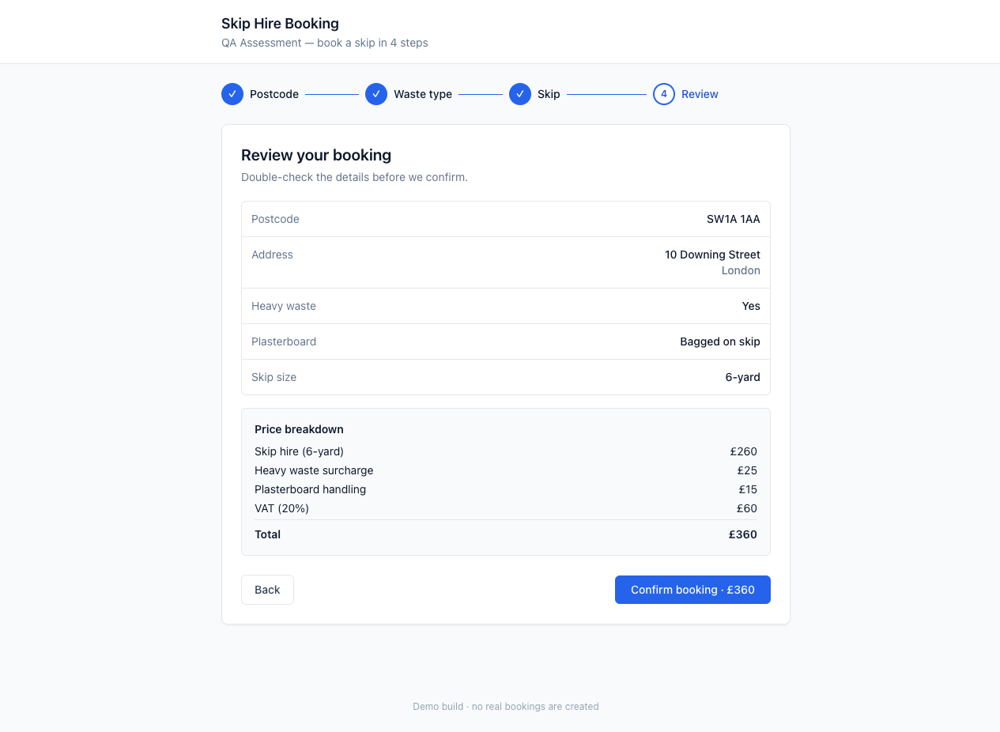
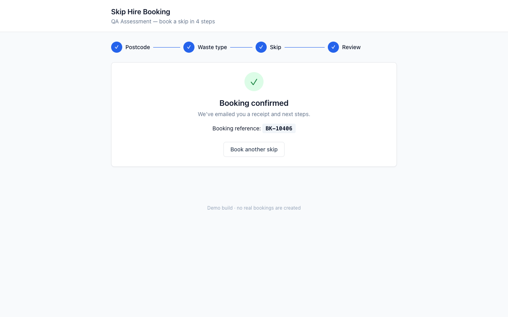

# Product walkthrough — Booking Flow

A step-by-step tour of the four-step UK skip-hire booking flow. Use this
together with the screenshots in [`ui/screenshots/`](../ui/screenshots/) and
the recorded video at [`ui/video/booking-walkthrough.webm`](../ui/video/booking-walkthrough.webm).

> **Watch the video** — `ui/video/booking-walkthrough.webm` is a 1280×720 .webm
> recorded by Playwright walking the full happy path. It is regenerated on
> demand by `npm run test:video`. If the UI ever breaks the script, the video
> stops at the broken step and the test fails — so the file is always either
> a passing flow or it doesn't exist.

---

## Table of contents

- [Step 1 — Postcode lookup](#step-1--postcode-lookup)
- [Step 2 — Waste type](#step-2--waste-type)
- [Step 3 — Skip selection](#step-3--skip-selection)
- [Step 4 — Review and confirm](#step-4--review-and-confirm)
- [Step 5 — Confirmation](#step-5--confirmation)
- [State transitions](#state-transitions)
- [API calls fired during the flow](#api-calls-fired-during-the-flow)

---

## Step 1 — Postcode lookup



**File:** [`src/components/PostcodeStep.tsx`](../src/components/PostcodeStep.tsx)
· **API:** `POST /api/postcode/lookup`

### What the user sees
- A single text input asking for a UK postcode.
- A **Find addresses** button, disabled until the input has content.
- A "Continue" button at the bottom, disabled until an address is selected.

### What the user does
1. Types a postcode (the validator accepts mainland UK formats — `A9 9AA`,
   `AA9A 9AA`, `AA9 9AA`, etc., spaces and casing flexible).
2. Clicks **Find addresses**.
3. Picks an address from the returned list (or expands the **Enter address
   manually** fallback if their address isn't listed).
4. Clicks **Continue**.

### What the system does
- Validates the postcode against the UK regex
  (`/^[A-Z]{1,2}\d[A-Z\d]?\s*\d[A-Z]{2}$/i`) before firing any request — bad
  format never reaches the API.
- Calls `POST /api/postcode/lookup` with `{ postcode }`.
- Renders one of four states:

| State | Trigger | Screenshot |
|---|---|---|
| **Loading** | Lookup in flight | [`desktop-02-postcode-loading.png`](../ui/screenshots/desktop-02-postcode-loading.png) |
| **Address list** | 200 with non-empty `addresses` | [`desktop-05-postcode-addresses.png`](../ui/screenshots/desktop-05-postcode-addresses.png) |
| **Empty** | 200 with `addresses: []` | [`desktop-03-postcode-empty-state.png`](../ui/screenshots/desktop-03-postcode-empty-state.png) |
| **Error + retry** | 5xx response | [`desktop-04-postcode-error.png`](../ui/screenshots/desktop-04-postcode-error.png) |

### Deterministic test postcodes
Used by the manual tests, the E2E suite, and this walkthrough:

| Postcode | Behaviour |
|---|---|
| `SW1A 1AA` | Returns 13 real addresses — happy path |
| `EC1A 1BB` | Returns 0 addresses — exercises the empty state |
| `M1 1AE` | ~2.5 s server delay — exercises the loading spinner |
| `BS1 4DJ` | First call returns 500, every subsequent call succeeds — exercises error + retry |

---

## Step 2 — Waste type



**File:** [`src/components/WasteTypeStep.tsx`](../src/components/WasteTypeStep.tsx)
· **API:** `POST /api/waste-types` (called on **Continue**)

### What the user sees
- Two checkboxes:
  - **Heavy waste** (soil, rubble, concrete)
  - **Plasterboard** (must be handled separately)
- A **Continue** button, enabled by default *unless* plasterboard is checked
  without a handling option chosen.

### Branching logic
This is the most-tested branch in the manual cases:

1. If **Plasterboard** is unchecked → no extra UI, **Continue** is enabled.
2. If **Plasterboard** is checked → three radio handling options reveal:
   - **Bagged on skip**
   - **Separate collection**
   - **Small quantity (under 10%)**
3. **Continue** stays *disabled* until one of the three radios is selected.

### What the system does
On **Continue**:
- Calls `POST /api/waste-types` with `{ heavyWaste, plasterboard, plasterboardOption }`.
- The server validates the plasterboard combination (option required iff
  plasterboard=true). On success it returns `{ ok: true }`.
- The choice is stored in flow state. **Heavy waste** drives the disabled-set
  on the next step.

---

## Step 3 — Skip selection



**File:** [`src/components/SkipStep.tsx`](../src/components/SkipStep.tsx)
· **API:** `GET /api/skips?postcode=…&heavyWaste=…`

### What the user sees
- A grid of 9 skip tiles (4-yard through 40-yard) with prices.
- When **Heavy waste** was selected on Step 2, the four largest skips
  (14-yard, 16-yard, 20-yard, 40-yard) render greyed-out with a tooltip
  reading *"Not available for heavy waste due to weight limits."*

### What the user does
- Clicks an enabled tile to select it.
- Clicks **Continue** to advance.

### What the system does
- Calls `GET /api/skips` with the postcode and heavy-waste flag as query params.
- The response shape is `{ skips: [{ size, price, disabled, disabledReason? }] }`.
  `disabledReason` is only present on disabled skips and is shown in the
  tooltip.
- Disabled tiles set `aria-disabled="true"` and ignore clicks. The selector
  test in [`automation/tests/heavy-plasterboard.spec.ts`](../automation/tests/heavy-plasterboard.spec.ts)
  asserts both the count (≥2) and the `aria-disabled` attribute.

---

## Step 4 — Review and confirm



**File:** [`src/components/ReviewStep.tsx`](../src/components/ReviewStep.tsx)
· **API:** `POST /api/booking/confirm` (called on **Confirm booking**)

### What the user sees
- A summary card with all five facts of the booking:
  postcode · address · heavy waste yes/no · plasterboard handling · skip size.
- A price breakdown:
  - Skip hire (the chosen size) → e.g. `£300`
  - **Heavy waste surcharge** `£25` *(only if heavy waste was selected)*
  - **Plasterboard handling** `£15` *(only if plasterboard was selected)*
  - VAT (20%) — applied to the pre-VAT total
  - **Total**
- **Back** and **Confirm booking · £TOTAL** buttons.

### Worked example — heavy + plasterboard + 8-yard
```
Skip hire (8-yard)        £300
Heavy waste surcharge     £25
Plasterboard handling     £15
                          ----
Pre-VAT                   £340
VAT (20%)                 £68
                          ----
Total                     £408
```

### What the system does
On **Confirm booking** click:
- The button immediately disables and shows `Confirming…` (visual feedback).
- A `useRef` synchronous guard ([`ReviewStep.tsx:51`](../src/components/ReviewStep.tsx#L51))
  prevents double-submit even if the user manages to click 5× before React
  re-renders — the second click sees `inFlight.current === true` and bails.
- Calls `POST /api/booking/confirm` with the full booking payload **including
  the price**. The server re-derives the price from its own fixtures and
  rejects the call with a 409 if they disagree (price-tampering guard).
- On 200, transitions to Step 5.

### Server-side guards on `confirm`
The contract isn't trusting the client. Section 5 of the spec is enforced by
[`src/app/api/booking/confirm/route.ts`](../src/app/api/booking/confirm/route.ts):

| Server check | Status | Why |
|---|---|---|
| Missing required field | 422 | Catches malformed clients |
| Invalid postcode format | 422 | UK regex |
| Unknown `addressId` for the postcode | 422 | Address must exist in fixtures |
| Unknown `skipSize` | 422 | Defends against API-only callers |
| Disabled skip (e.g. heavy + 14-yard) | 409 | UI may be wrong/tampered with |
| Price mismatch | 409 | Client-side price tampering |
| Identical submission within 10 s | 200 (deduped) | Idempotency guard — returns the original `bookingId` plus `deduplicated: true` |

---

## Step 5 — Confirmation



**File:** [`src/components/ConfirmationStep.tsx`](../src/components/ConfirmationStep.tsx)

### What the user sees
- A success card with the booking ID (`BK-XXXXX` format, regex
  `/^BK-\d{5}$/`).
- A **Start over** button that resets the entire flow state.

The booking ID is generated server-side (`Math.floor(10000 + Math.random() * 90000)`),
so it's stable for the lifetime of the dedupe window even if the user reloads
between steps.

---

## State transitions

The whole flow is one component owning one state machine
([`BookingFlow.tsx`](../src/components/BookingFlow.tsx)). Each step receives
its slice of state and a typed `onContinue`/`onBack` callback.

```
postcode  ──▶  waste  ──▶  skip  ──▶  review  ──▶  done
   ▲           │           │          │
   │           ▼           ▼          ▼
   └──────── back ──── back ──── back

(Once `done`, only the "Start over" button can leave that state — it resets
to `postcode` with the initial state.)
```

**Notable detail:** if the user goes back to Step 2 and toggles **Heavy
waste** off → on (or vice versa), the previously-selected skip is cleared
([`BookingFlow.tsx:79-82`](../src/components/BookingFlow.tsx#L79-L82)). This
prevents the user landing on a Review step that references a now-disabled
skip.

---

## API calls fired during the flow

| Step | Method | URL | When |
|---|---|---|---|
| 1 | `POST` | `/api/postcode/lookup` | On **Find addresses** |
| 2 | `POST` | `/api/waste-types` | On **Continue** |
| 3 | `GET`  | `/api/skips?postcode=…&heavyWaste=…` | On entering Step 3 |
| 4 | `POST` | `/api/booking/confirm` | On **Confirm booking** |

The full request and response shape for each is documented and verified by
the contract test suite at
[`automation/tests/api-contract.spec.ts`](../automation/tests/api-contract.spec.ts) —
22 cases covering happy path, error envelope, dedupe, and every guard above.
